# Promptify: Prompt Guard for AI Chatbots

> **"Your Personal Firewall for AI Interactions."**
> A Chrome Extension that prevents accidental leakage of sensitive Indian PII (Personally Identifiable Information) to AI platforms like ChatGPT and Gemini.

---

## Table of Contents
- [The Problem](#-the-problem)
- [The Solution](#-the-solution)
- [System Architecture](#-system-architecture)
- [Data Flow](#-data-flow)
- [Key Features](#-key-features)
- [Tech Stack](#-tech-stack)
- [Installation Guide](#-installation-guide)
- [How to Use](#-how-to-use)

---

## The Problem
AI chatbots collect massive amounts of user data. Users often accidentally paste sensitive information—like **Phone Numbers**, **PAN Cards**, or **Internal Code**—into prompts. Once sent, this data leaves your control and could potentially be used for model training.

## The Solution
**Promptify** acts as a **Client-Side Interceptor**. It runs entirely in your browser, scanning your input in real-time. If it detects sensitive data, it:
1.  **Alerts** you visually (Red Badge) when it finds personal information into the prompt.
2.  **Blocks** file uploads containing secrets.
3.  **Sanitizes** data automatically with "Smart Swap" (Pseudonymization).

---

## System Architecture

This project follows a **Privacy-First Architecture**. No data is sent to any external server. Everything happens locally within the Chrome Browser.

## Data Flow

```mermaid
sequenceDiagram
    participant User
    participant Promptify as Promptify-AI (Extension)
    participant Chat as ChatGPT Interface
    
    User->>Chat: Types "My phone is 9876543210"
    Promptify->>Promptify: Intercepts & Scans Text
    Promptify-->>User: 🔴 Shows "Privacy Risk" Alert
    
    User->>Promptify: Clicks "✨ Clean Data" Button
    
    Promptify->>Promptify: Backs up original text to Memory (Vault)
    Promptify->>Chat: Swaps with "My phone is 0000000000"
    Promptify-->>User: 🟢 Shows "Secure Mode" Badge
    
    User->>Chat: Sends Prompt (Safe Data)
    
    opt If User wants to Undo
        User->>Promptify: Clicks "↩️ Restore"
        Promptify->>Chat: Restores "9876543210" from Vault
    end
```

## Key Features

*1. India-Specific PII Detection*

        Custom Regex patterns tailored for Indian users:
        
        Phone Numbers: +91 or 6-9 start digits.
        PAN Cards: ABCDE1234F format.
        Emails: Standard email patterns.

*2. Smart Swap & Restore*

        Pseudonymization: Replaces real data with formatted dummy data (e.g., 9999999999) to keep the AI's context              intact.

        Undo Capability: One-click restore allows you to revert changes if needed.

*3. File Upload Guard (Advanced)*

    Interception: Detects when a user uploads a file (.txt, .csv, .js).

    Scan: Reads the file content before it reaches the server.

    Auto-Clean: Can create a new cleaned version of the file and upload that instead.

*4. Zero-Lag Performance*

    Uses MutationObserver and Event Delegation to watch for changes efficiently without slowing down the browser.

## Tech Stack

| Component | Technology | Description |
|---|---|---|
| Manifest | V3 | Latest Chrome Extension Standard |
| Language | JavaScript (ES6+) | Core Logic |
| Styling | CSS3 | UI Overlays & Badges |
| Regex | JS RegExp | Pattern Matching Engine |
| Browser API | FileReader / MutationObserver | DOM & File Manipulation |

## Installation Guide

    Since this project is in development, you install it via "Developer Mode":

    Clone the Repository

        Bash

        git clone [https://github.com/YOUR_USERNAME/Promptify.git](https://github.com/YOUR_USERNAME/Promptify.git)
        
    Open Chrome Extensions

    Go to chrome://extensions/ in your browser.

    Enable Developer Mode

    Toggle the switch in the top-right corner.

    Load Extension

    Click "Load unpacked".

    Select the folder where you cloned the code.

    Pin It 📌

    Pin the extension to your toolbar for easy access.

## How to Use

Protecting Text Chat

    Open ChatGPT.

    Type a sentence with a phone number (e.g., Call me at 9876543210).

    Look for the Red Warning Badge 🔴 in the bottom right.

    Click "✨ Clean Data" to automatically sanitize the text.

Protecting File Uploads

    Click the Attachment (Paperclip) icon in ChatGPT.

    Select a text file containing sensitive info.

    Promtify will Block the Upload and show a popup.

    Click "Clean & Auto-Upload" to sanitize and attach the safe version.

## Future Roadmap

    Support for PDF & Image (OCR) scanning.

    Custom "Allow List" for trusted data.

    Enterprise Admin Dashboard for teams.

    Support for Claude AI and Microsoft Copilot.

